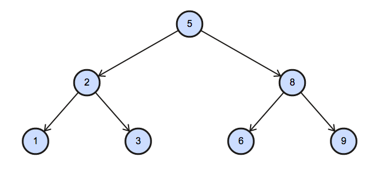

# Topic: Advance Select
# 1. Type of Triangle

Write a query identifying the type of each record in the TRIANGLES table using its three side lengths. Output one of the following statements for each record in the table:

Equilateral: It's a triangle with 3 sides of equal length.
Isosceles: It's a triangle with 2 sides of equal length.
Scalene: It's a triangle with 3 sides of differing lengths.
Not A Triangle: The given values of A, B, and C don't form a triangle.

**Input Format**

The TRIANGLES table is described as follows:


**Solution: MySQL**

``` sql
SELECT 
    IF(A+B>C,
        CASE 
            WHEN A=B AND A=C THEN "Equilateral"
            WHEN A=B AND A!=C THEN "Isosceles"
            WHEN A!=B AND A=C THEN "Isosceles"
            WHEN A!=B AND A!=C THEN "Scalene"
        END ,
        "Not A Triangle" ) 
FROM TRIANGLES;
```

# 2. The PADS

Generate the following two result sets:  

1. Query an alphabetically ordered list of all names in OCCUPATIONS, immediately followed by the first letter of each profession as a parenthetical (i.e.: enclosed in parentheses). For example: AnActorName(A), ADoctorName(D), AProfessorName(P), and ASingerName(S).  
2. Query the number of ocurrences of each occupation in OCCUPATIONS. Sort the occurrences in ascending order, and output them in the following format:  
	There are a total of [occupation_count] [occupation]s.  
where [occupation_count] is the number of occurrences of an occupation in OCCUPATIONS and [occupation] is the lowercase occupation name. If more than one Occupation has the same [occupation_count], they should be ordered alphabetically.  
  
**Note:** There will be at least two entries in the table for each type of occupation.  
  
**Input Format**
The OCCUPATIONS table is described as follows:  


Occupation will only contain one of the following values: Doctor, Professor, Singer or Actor.  
  
**Sample Input** 
An OCCUPATIONS table that contains the following records: 


**Solution: MySQL**

``` sql
SELECT CONCAT(Name,'(',LEFT(Occupation, 1),')')
FROM Occupations
ORDER BY name;

SELECT CONCAT('There are a total of ', COUNT(Occupation), ' ', LOWER(Occupation), 's.')
FROM Occupations
GROUP BY Occupation 
ORDER BY COUNT(Occupation), Occupation ASC;
```

# 3. Occupations

***Pivot*** the Occupation column in OCCUPATIONS so that each Name is sorted alphabetically and displayed underneath its corresponding Occupation. The output column headers should be Doctor, Professor, Singer, and Actor, respectively.

Note: Print NULL when there are no more names corresponding to an occupation.

**Input Format**

The OCCUPATIONS table is described as follows:


Occupation will only contain one of the following values: **Doctor**, **Professor**, **Singer** or **Actor**.

**Sample Input**


**Sample Output**  
  
	Jenny    Ashley     Meera  Jane
	Samantha Christeen  Priya  Julia
	NULL     Ketty      NULL   Maria
  
**Explanation**  
  
The first column is an alphabetically ordered list of Doctor names.  
The second column is an alphabetically ordered list of Professor names.  
The third column is an alphabetically ordered list of Singer names.  
The fourth column is an alphabetically ordered list of Actor names.  
The empty cell data for columns with less than the maximum number of names per occupation (in this case, the Professor and Actor columns) are filled with NULL values.  

**Solution: MySQL**

``` sql
WITH RankedOccupations AS (
    SELECT Name,
           Occupation,
           ROW_NUMBER() OVER (PARTITION BY Occupation ORDER BY Name) AS RowNum
    FROM OCCUPATIONS
),

PivotedOccupations AS (
    SELECT
        MAX(CASE WHEN Occupation = 'Doctor' THEN Name END) AS Doctor,
        MAX(CASE WHEN Occupation = 'Professor' THEN Name END) AS Professor,
        MAX(CASE WHEN Occupation = 'Singer' THEN Name END) AS Singer,
        MAX(CASE WHEN Occupation = 'Actor' THEN Name END) AS Actor,
        RowNum
    FROM RankedOccupations
    GROUP BY RowNum
)
SELECT Doctor, Professor, Singer, Actor
FROM PivotedOccupations
ORDER BY RowNum;
```
# 4. Binary Tree Nodes

You are given a table, BST, containing two columns: N and P, where N represents the value of a node in Binary Tree, and P is the parent of N.


Write a query to find the node type of Binary Tree ordered by the value of the node. Output one of the following for each node:

Root: If node is root node.
Leaf: If node is leaf node.
Inner: If node is neither root nor leaf node.

**Sample Input**  
  

  
**Sample Output**
  
1 Leaf  
2 Inner  
3 Leaf  
5 Root  
6 Leaf  
8 Inner  
9 Leaf  
  
**Explanation** 

The Binary Tree below illustrates the sample:



**Solution: MySQL**

``` sql
SELECT N,
    CASE 
        WHEN P IS NULL THEN 'Root'
        WHEN N IN (SELECT P FROM BST) THEN 'Inner'
        ELSE 'Leaf' END
FROM BST
ORDER BY N;
```

# 5. New Companies

Amber's conglomerate corporation just acquired some new companies. Each of the companies follows this hierarchy:   
  
  
  
Given the table schemas below, write a query to print the company_code, founder name, total number of lead managers, total number of senior managers, total number of managers, and total number of employees. Order your output by ascending company_code.   
  
**Note:**  
The tables may contain duplicate records.  
The company_code is string, so the sorting should not be numeric. For example, if the company_codes are C_1, C_2, and C_10, then the ascending company_codes will be C_1, C_10, and C_2.  
  
**Input Format**  
The following tables contain company data:  
Company: The company_code is the code of the company and founder is the founder of the company.   
  


Lead_Manager: The lead_manager_code is the code of the lead manager, and the company_code is the code of the working company.   
  
  
  
Senior_Manager: The senior_manager_code is the code of the senior manager, the lead_manager_code is the code of its lead manager, and the company_code is the code of the working company.   
  
 
  
Manager: The manager_code is the code of the manager, the senior_manager_code is the code of its senior manager, the lead_manager_code is the code of its lead manager, and the company_code is the code of the working company.  
  

  
Employee: The employee_code is the code of the employee, the manager_code is the code of its manager, the senior_manager_code is the code of its senior manager, the lead_manager_code is the code of its lead manager, and the company_code is the code of the working company.  


**Solution: MySQL**

``` sql
SELECT c.company_code, c.founder, COUNT(DISTINCT e.lead_manager_code), COUNT(DISTINCT e.senior_manager_code), COUNT(DISTINCT e.manager_code), COUNT(DISTINCT e.employee_code) 
FROM company AS c
JOIN employee AS  e 
ON c.company_code = e.company_code 
GROUP BY c.company_code, c.founder 
ORDER BY c.company_code;
```