# Topic: Basic Joins
# 1. Challenges

Julia asked her students to create some coding challenges. Write a query to print the hacker_id, name, and the total number of challenges created by each student. Sort your results by the total number of challenges in descending order. If more than one student created the same number of challenges, then sort the result by hacker_id. If more than one student created the same number of challenges and the count is less than the maximum number of challenges created, then exclude those students from the result.

The following tables contain challenge data:

Hackers: The hacker_id is the id of the hacker, and name is the name of the hacker. 

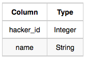

Challenges: The challenge_id is the id of the challenge, and hacker_id is the id of the student who created the challenge. 

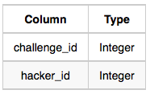

**Solution:**
``` sql
WITH challenge_counts AS (
    SELECT 
        h.hacker_id, 
        h.name, 
        COUNT(c.challenge_id) AS total_challenges
    FROM 
        hackers AS h
    LEFT JOIN 
        challenges AS c ON h.hacker_id = c.hacker_id
    GROUP BY 
        h.hacker_id, h.name
),
max_challenges AS (
    SELECT 
        MAX(total_challenges) AS max_challenges
    FROM 
        challenge_counts
),
filtered_counts AS (
    SELECT 
        total_challenges
    FROM 
        challenge_counts
    GROUP BY 
        total_challenges
    HAVING 
        COUNT(*) = 1
)
SELECT 
    cc.hacker_id,
    cc.name,
    cc.total_challenges
FROM 
    challenge_counts AS cc
WHERE 
    cc.total_challenges = (SELECT max_challenges FROM max_challenges)
    OR (cc.total_challenges < (SELECT max_challenges FROM max_challenges) 
        AND cc.total_challenges IN (SELECT total_challenges FROM filtered_counts))
ORDER BY 
    cc.total_challenges DESC, 
    cc.hacker_id ASC;
```
# 2. Contest Leaderboard

You did such a great job helping Julia with her last coding contest challenge that she wants you to work on this one, too!

The total score of a hacker is the sum of their maximum scores for all of the challenges. Write a query to print the hacker_id, name, and total score of the hackers ordered by the descending score. If more than one hacker achieved the same total score, then sort the result by ascending hacker_id. Exclude all hackers with a total score of ```0``` from your result.

**Input Format**

The following tables contain contest data:

Hackers: The hacker_id is the id of the hacker, and name is the name of the hacker.

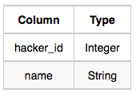

Submissions: The submission_id is the id of the submission, hacker_id is the id of the hacker who made the submission, challenge_id is the id of the challenge for which the submission belongs to, and score is the score of the submission.

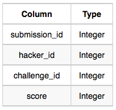

**Solution:**

``` sql
WITH max_scores AS (
    SELECT h.hacker_id, h.name, s.challenge_id, MAX(s.score) AS max_score
    FROM hackers AS h
    RIGHT JOIN submissions AS s
    ON h.hacker_id = s.hacker_id
    GROUP BY h.hacker_id, h.name, s.challenge_id
)

SELECT m.hacker_id, m.name, SUM(m.max_score) AS total_score
FROM max_scores AS m
GROUP BY m.hacker_id, m.name
HAVING SUM(m.max_score) > 0
ORDER BY total_score DESC, m.hacker_id;
```

# 3. Average Population of Each Continent

Given the CITY and COUNTRY tables, query the names of all the continents (COUNTRY.Continent) and their respective average city populations (CITY.Population) rounded down to the nearest integer.

**Note:** CITY.CountryCode and COUNTRY.Code are matching key columns.

**Input Format**

The **CITY** and **COUNTRY** tables are described as follows:


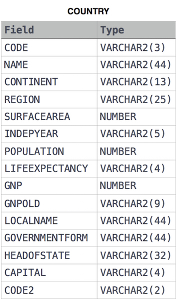

**Solution:**

``` sql
SELECT COUNTRY.CONTINENT, FLOOR(AVG(CITY.POPULATION)) 
FROM COUNTRY
INNER JOIN CITY
ON COUNTRY.CODE = CITY.COUNTRYCODE
GROUP BY COUNTRY.CONTINENT;  
```
# 4. The Report

You are given two tables: Students and Grades. Students contains three columns ID, Name and Marks.

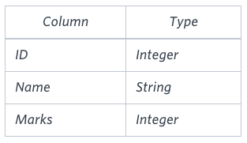

Grades contains the following data:


Ketty gives Eve a task to generate a report containing three columns: Name, Grade and Mark. Ketty doesn't want the NAMES of those students who received a grade lower than 8. The report must be in descending order by grade -- i.e. higher grades are entered first. If there is more than one student with the same grade (8-10) assigned to them, order those particular students by their name alphabetically. Finally, if the grade is lower than 8, use "NULL" as their name and list them by their grades in descending order. If there is more than one student with the same grade (1-7) assigned to them, order those particular students by their marks in ascending order.

Write a query to help Eve.

**Note**

Print "NULL"  as the name if the grade is less than 8.

**Solution: (Uses Implicit Join)**

``` sql
SELECT 
    CASE WHEN Grades.Grade < 8 THEN 'Null' ELSE Students.Name END AS StudentName,
    Grades.Grade, 
    Students.Mark
FROM Students, Grades 
WHERE Students.Mark >= Grades.Min_Mark AND Students.Mark <= Grades.Max_Mark 
ORDER BY Grades.Grade DESC, Students.Name;
```

# 5. Top Competitors

Julia just finished conducting a coding contest, and she needs your help assembling the leaderboard! Write a query to print the respective hacker_id and name of hackers who achieved full scores for more than one challenge. Order your output in descending order by the total number of challenges in which the hacker earned a full score. If more than one hacker received full scores in same number of challenges, then sort them by ascending hacker_id.

**Input Format**

The following tables contain contest data:

Hackers: The hacker_id is the id of the hacker, and name is the name of the hacker.

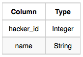

Difficulty: The difficult_level is the level of difficulty of the challenge, and score is the score of the challenge for the difficulty level.

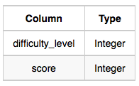

Challenges: The challenge_id is the id of the challenge, the hacker_id is the id of the hacker who created the challenge, and difficulty_level is the level of difficulty of the challenge.

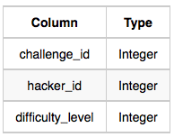

Submissions: The submission_id is the id of the submission, hacker_id is the id of the hacker who made the submission, challenge_id is the id of the challenge that the submission belongs to, and score is the score of the submission.

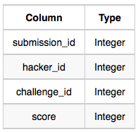

**Solution:**

``` sql
SELECT h.hacker_id, h.name
FROM hackers AS h
RIGHT JOIN submissions AS s
ON h.hacker_id = s.hacker_id
RIGHT JOIN challenges AS c
ON s.challenge_id = c.challenge_id
RIGHT JOIN difficulty AS d
ON c.difficulty_level = d.difficulty_level
WHERE s.score = d.score
GROUP BY h.hacker_id, h.name
HAVING COUNT(*) > 1
ORDER BY COUNT(*) DESC, hacker_id ASC
```

# 6. Ollivander's Inventory

Harry Potter and his friends are at Ollivander's with Ron, finally replacing Charlie's old broken wand.

Hermione decides the best way to choose is by determining the minimum number of gold galleons needed to buy each non-evil wand of high power and age. Write a query to print the id, age, coins_needed, and power of the wands that Ron's interested in, sorted in order of descending power. If more than one wand has same power, sort the result in order of descending age.

**Input Format**

The following tables contain data on the wands in Ollivander's inventory:

Wands: The id is the id of the wand, code is the code of the wand, coins_needed is the total number of gold galleons needed to buy the wand, and power denotes the quality of the wand (the higher the power, the better the wand is).

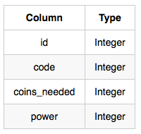

Wands_Property: The code is the code of the wand, age is the age of the wand, and is_evil denotes whether the wand is good for the dark arts. If the value of is_evil is 0, it means that the wand is not evil. The mapping between code and age is one-one, meaning that if there are two pairs, ``(code1, age1)`` and ``(code2, age2)``, then ``code1 != code2`` and ``age1 != age2``.

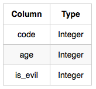

**Solution:**

```sql
SELECT W.ID, P.AGE, W.COINS_NEEDED, W.POWER 
FROM WANDS AS W
JOIN WANDS_PROPERTY AS P
ON (W.CODE = P.CODE) 
WHERE P.IS_EVIL = 0 AND W.COINS_NEEDED = (SELECT MIN(COINS_NEEDED) 
                                          FROM WANDS AS W_IN
                                          JOIN WANDS_PROPERTY AS P_IN
                                          ON (W_IN.CODE = P_IN.CODE) 
                                          WHERE W_IN.POWER = W.POWER AND P_IN.AGE = P.AGE) 
ORDER BY W.POWER DESC, P.AGE DESC;
```
